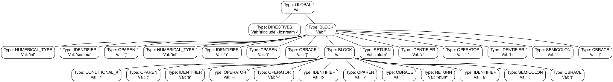

# Documentazione Tecnica delle Strutture Dati
## Consegna 6

Il seguente documento serve a dare una spiegazione tecnica e decisionale delle strututre dati 
utilizzate nella **consegna 6**

#### Indice

- [Enumerazioni](#enumerazioni-principali-enumsh)
  - [Tipi di token](#11-token_type-mappato-come-tokentype)
  - [Tipi di punteggio](#12-scoring_rules-mappato-come-scoringrules)
  - [Tipi di caratteri differenziali](#13-diff_type-mappato-come-difftype)
- [Strutture dati](#strutture-dati)
  - [Strutture dati per i token](#2-strutture-dati-per-la-tokenizzazione-queueh--queuecpp)
  - [Strutture dati per i differ](#3-strutture-dati-per-la-gestione-del-diff-stackh--stackcpp)
  - [Strutture dati per i blocchi del codice](#4-strutture-dati-per-il-matching-strutturale-nw_treeh--nw_treecpp)
  - [Riassunto complessita'](#5-sintesi-delle-complessità-delle-strutture-dati)
- [Funzioni di parsing](#funzione-di-parsing-e-costruzione-dellalbero-strutturale)
  - [`parser()`](#parserconst-stdstring-file_name)
  - [`findBlocks()`](#findblocksqueue_t-tokens)
- [Funzione di punteggio](#funzione-di-similarity-assegnamento-dei-punteggi)
- [Algoritmo di Needleman-Wunsch](#lalgoritmo-di-needleman-wunsch)
---

## Enumerazioni Principali (`enums.h`)

Ho pensato di gestire le varie parole come token e per dare un senso al token avevo bisogno di categorizzarlo, 
percio' sono state create svariate enumerazioni che contengono i tipi di token per facilitarne l'utilizzo durante lo sviluppo.
In piu' sono stati aggiunti anche i vari tipi di punteggi, sempre per facilitarne lo sviluppo

### 1.1 `TOKEN_TYPE` (Mappato come `TokenType`)
Definisce la categoria sintattica di ogni singolo elemento identificato dal parser lessicale:
* `DIRECTIVES`: Linee di preprocessore (es. `#include`, `#define`).
* `IDENTIFIER`: Nomi di variabili, funzioni o tipi personalizzati.
* `NUMBER` / `STRING`: Costanti letterali numeriche o stringhe testuali.
* `POINTER`: Operatore di dereferenziazione o dichiarazione di puntatore (`*`).
* `OPERATOR`: Operatori matematici, logici o di assegnamento (`+`, `-`, `==`, `=`, ecc.).
* `SEMICOLON`: Il carattere di terminazione istruzione `;`.
* `NUMERICAL_TYPE` / `LITERAL_TYPE` / `BOOLEAN_TYPE` / `VOID_TYPE`: Tipi primitivi del linguaggio (`int`, `float`, `string`, `char`, `bool`, `void`).
* `CONDITIONAL_K` / `LOOP_K`: Parole chiave di controllo (`if`, `switch`, `for`, `while`, `do`).
* `RETURN` / `BREAK` / `CONTINUE`: Istruzioni di salto o di interruzione del flusso.
* `OBRACE` (`{`) / `CBRACE` (`}`) / `OPAREN` (`(`) / `CPAREN` (`)`): Delimitatori sintattici di blocchi e parametri.
* `BLOCK`: Token speciale astratto utilizzato esclusivamente per identificare i nodi interni dell'albero sintattico.

### 1.2 `SCORING_RULES` (Mappato come `ScoringRules`)
Contiene i pesi numerici interi che guidano la funzione di similarità dell'algoritmo di Needleman-Wunsch:
* `EMATCH_SCOPE` (`+10`): Massimo punteggio per la corrispondenza esatta tra due sotto-blocchi strutturali.
* `EMATCH_VAR` (`+4`): Corrispondenza perfetta di una variabile (stesso tipo e stesso nome).
* `RENAMING` (`+1`): Assegnato quando due variabili o funzioni hanno lo stesso tipo ma nomi differenti (tolleranza al refactoring).
* `GAP_PENALTY` (`-2`): Penalità per l'inserimento o la cancellazione (gap) di un elemento nella matrice di allineamento.
* `MISMATCH_LIGHT` (`-1`): Discrepanza lieve tra token compatibili.
* `MISMATCH_SEVERE` (`-5`): Forte penalità per la discrepanza tra elementi incompatibili (es. confrontare un tipo numerico con un blocco logico).

### 1.3 `DIFF_TYPE` (Mappato come `DiffType`)
Caratteri identificativi utilizzati per l'output visuale delle differenze strutturali:
* `REMOVED` (`-`): Elemento presente nel sorgente originario ma assente nel target.
* `ADDED` (`+`): Elemento assente nel sorgente originario ma aggiunto nel target.
* `MODIFIED` (`*`): Sostituzione/Modifica inline di un token (es. rinomina).
* `NOTHING` (` `): Nessuna modifica (i token corrispondono perfettamente).

---

## Strutture dati

### 2. Strutture Dati per la Tokenizzazione (`queue.h` / `queue.cpp`)

Il parser genera un flusso lineare di token. 
Per memorizzarlo in modo efficiente rispettando l'ordine di 
lettura **FIFO**, è stata implementata una coda dinamica basata su 
lista concatenata semplice.

#### 2.1 Classe `Token`
Rappresenta l'atomo informativo risultante dall'analisi lessicale del codice.

##### Campi Membro
* `TokenType key`: La categoria sintattica del token.
* `std::string val`: Il valore testuale estratto direttamente dal codice sorgente.

##### Metodi Principali
* `Token()`: Costruttore di default, inizializza a `UNKNOWN` e stringa vuota.
* `Token(TokenType type, std::string val)`: Costruttore parametrizzato per la creazione esplicita dei token durante il parsing.
* `std::string tostring(std::string c) const`: Restituisce una rappresentazione formattata del tipo e del valore del token sotto forma di stringa leggibile (es. `[IDENTIFIER => somma]`).

#### 2.2 Struttura `node`
Rappresenta il nodo fisico elementare della lista concatenata che costituisce la struttura interna della coda.

##### Campi Membro
* `Token* data`: Puntatore all'oggetto `Token` allocato dinamicamente.
* `node* next`: Puntatore al nodo successivo all'interno della lista (`nullptr` se è l'ultimo).

#### 2.3 Classe `queue` (o `queue_t`)
Implementazione della struttura dati Coda FIFO per la gestione lineare dei token prodotti dal parser.

##### Campi Membro
* `node* head`: Puntatore al primo elemento della coda (punto di estrazione/pop).
* `node* tail`: Puntatore all'ultimo elemento inserito (punto di inserimento/push).
* `int size`: Contatore intero del numero di elementi attualmente presenti nella coda.

##### Dettaglio Operazioni e Complessità O-Grande
* `void push(Token* data)`: Inserisce un nuovo token in coda alla lista. Aggiorna il puntatore `tail`.
    * *Complessità temporale:* $O(1)$ grazie al mantenimento del puntatore all'ultimo nodo.
* `Token* pop()`: Estrae e restituisce il token in testa alla coda, riallocando i puntatori interni ed eliminando il nodo di supporto (`node`).
    * *Complessità temporale:* $O(1)$.
* `bool empty() const`: Verifica se la coda è priva di elementi (`size == 0`).
    * *Complessità temporale:* $O(1)$.
<!-- * `Token** c_array() const`: Esporta l'intero contenuto della coda in un array vecchio stile (C-style array) di puntatori a `Token`, terminato da un puntatore `nullptr` in posizione `0` o alla fine per facilitare le iterazioni indicizzate.
    * *Complessità temporale:* $O(N)$, dove $N$ è la dimensione della coda. -->

---

### 3. Strutture Dati per la Gestione del Diff (`stack.h` / `stack.cpp`)

L'algoritmo di Needleman-Wunsch calcola l'allineamento ottimale partendo dall'angolo in basso a destra della matrice 
e risalendo all'indietro (fase di **backtracing**). 
Questo processo genera le operazioni di modifica in ordine inverso 
(dall'ultima riga del codice alla prima). 
Per ripristinare l'ordine corretto di lettura per la stampa, 
viene impiegato uno **stack** **LIFO**.

#### 3.1 Struttura `stack_node`
Rappresenta il singolo record di una modifica elementare applicata a un token o a un blocco.

##### Campi Membro
* `Token* token_source`: Puntatore al token nel file originale (usato in caso di cancellazione `REMOVED` o modifica `MODIFIED`).
* `Token* token_target`: Puntatore al token nel file di destinazione (usato in caso di aggiunta `ADDED` o modifica `MODIFIED`).
* `char op`: Il tipo di operazione codificato tramite i caratteri definiti in `DiffType` (`'-'`, `'+'`, `'*'`, `' '`).
* `stack_node* next`: Puntatore al record sottostante nello stack.

#### 3.2 Classe `stack`
Classe manager per la gestione della pila LIFO.

##### Campi Membro
* `stack_node* top`: Puntatore all'elemento sommitale della pila.
* `int size`: Numero di elementi correnti.

##### Dettaglio Operazioni e Complessità O-Grande
* `void push(Token* target, Token* source, char op)`: Alloca un `stack_node` e lo inserisce in cima alla pila.
    * *Complessità temporale:* $O(1)$.
* `stack_node* pop()`: Rimuove l'elemento in cima alla pila e lo restituisce al chiamante per l'elaborazione dell'output.
    * *Complessità temporale:* $O(1)$.
* `bool isEmpty() const`: Ritorna vero se la pila non contiene record.
    * *Complessità temporale:* $O(1)$.

---

### 4. Strutture Dati per il Matching Strutturale (`nw_tree.h` / `nw_tree.cpp`)

Per dare priorità alla struttura del codice (body annidati, funzioni, cicli) 
rispetto ai singoli caratteri testuali, il flusso lineare dei token viene 
convertito in una struttura gerarchica ad albero: l'**Albero dei Blocchi di 
Needleman-Wunsch (`NWTree`)**. 
I nodi interni rappresentano ambiti strutturali (`BLOCK`), 
mentre i nodi foglia o i figli diretti rappresentano 
le istruzioni atomiche del codice.

#### Esempio di costruizione dell'albero

Codice fornito al parser:
```c++
#include <iostream>

int somma(int a) {
    if (a == b) {
    	return a;
    }

	return a + b;
}
```

Albero ottenuto:



#### 4.1 Classe `NWTreeNode`
Rappresenta un nodo all'interno dell'albero sintattico astratto personalizzato. 
Ogni nodo può contenere un numero arbitrario di sotto-nodi (figli) 
per mappare gli annidamenti infiniti del codice.

##### Campi Membro
* `Token* token`: Il token descrittivo associato al nodo. Se il nodo è un blocco logico, la chiave del token è `BLOCK`.
* `NWTreeNode* father`: Puntatore al nodo genitore (fondamentale per risalire gli scope quando si incontra una parentesi graffa di chiusura `}`).
* `NWTreeNode** childs`: Array dinamico di puntatori a `NWTreeNode*`. Mantiene l'elenco ordinato delle istruzioni e dei sotto-blocchi contenuti in questo specifico scope.
* `int size`: Il numero attuale di figli inseriti.
* `int maxSize`: La capacità massima attuale dell'array dinamico `childs` prima che si renda necessaria una riallocazione.
<!-- * `int** diffMatrix`: Matrice di programmazione dinamica allocata localmente per calcolare l'allineamento dei sotto-blocchi (utilizzata nei calcoli ricorsivi). -->

##### Gestione Dinamica della Memoria e Funzioni Ausiliarie
* `void reallocChildren()`: Gestisce l'espansione dinamica del vettore dei figli quando la capacità corrente viene saturata.
    * *Logica di funzionamento:* Raddoppia la capacità corrente (`newSize = 2 * maxSize`), alloca una nuova porzione di memoria contigua, copia i puntatori dei nodi preesistenti mediante un ciclo iterativo, dealloca la vecchia memoria array con `delete[] childs` e assegna il nuovo indirizzo a `childs`.
    * *Complessità temporale:* $O(K)$ ammortizzato, dove $K$ è il numero di figli.
* `void addChild(NWTreeNode* child)`: Aggiunge un sotto-nodo al blocco corrente. Invoca automaticamente `reallocChildren()` se l'array è saturo.
    * *Complessità temporale:* $O(1)$ ammortizzato.
* `bool isLeaf() const`: Restituisce `true` se il nodo non possiede figli (`size == 0`), denotando un token terminale o un'istruzione atomica semplice.
<!-- * `void doGraphNode(std::ofstream& out) const`: Funzione ricorsiva di supporto per l'esportazione dell'albero in formato testuale Graphviz DOT. Utilizza l'indirizzo di memoria del puntatore (`uintptr_t`) come identificatore univoco del nodo grafico per evitare collisioni di nomi. -->

#### 4.2 Classe `NWTree`
Struttura contenitore che gestisce il punto di accesso radice dell'albero e le operazioni globali di ispezione.

##### Campi Membro
* `NWTreeNode* root`: Puntatore al nodo radice globale (`GLOBAL`) dell'intero file sorgente analizzato.
* `int size`: Numero totale di nodi strutturali registrati all'interno dell'albero.

##### Metodi Principali
* `void addRoot(NWTreeNode* root)`: Inizializza la radice dell'albero. Se viene passato un puntatore nullo, alloca automaticamente un nodo di default.
* `NWTreeNode* getRoot() const`: Restituisce il puntatore alla radice per avviare l'algoritmo di allineamento ricorsivo.
<!-- * `void doGraph(const std::string& filename) const`: Esporta l'intera struttura dell'albero in un file `.dot`. Questo file può essere compilato tramite Graphviz (es. comando `dot -Tpng albero.dot -o albero.png`) per visualizzare graficamente la gerarchia dei blocchi di codice, facilitando enormemente la fase di debug e verifica del parsing. -->

---

### 5. Sintesi delle Complessità delle Strutture Dati

La tabella seguente riassume le prestazioni temporali e spaziali delle strutture dati custom create nel progetto:

| Struttura Dati | Operazione Principale | Complessità Temporale | Complessità Spaziale | Note / Vincoli Progettuali |
| :--- | :--- | :--- | :--- | :--- |
| **`queue`** | `push` / `pop` | $O(1)$ | $O(1)$ per elemento | Ottimizzata con doppio puntatore (`head`/`tail`) per evitare scorrimenti. |
| **`stack`** | `push` / `pop` | $O(1)$ | $O(1)$ per elemento | Allocazione dinamica a nodi per memorizzare le operazioni di diff. |
| **`NWTreeNode`**| `addChild` | $O(1)$ ammortizzato | $O(K)$ capacità | Array dinamico a raddoppio geometrico per minimizzare le riallocazioni. |
| **`NWTree`** | Generazione AST | $O(N)$ totali | $O(N)$ nodi | Costruito in un singolo passaggio lineare del flusso di token. |

Attraverso questa architettura di classi e puntatori concatenati, l'algoritmo ricorsivo di allineamento inserito in `needleman_wunsch.cpp` è in grado di confrontare prima i nodi di tipo `BLOCK` e, solo in caso di corrispondenza strutturale, scendere in profondità per allineare le singole istruzioni figlie, realizzando pienamente l'obiettivo di un **matching strutturale tollerante alle modifiche superficiali** (come la rinomina di variabili o lo spostamento di blocchi di codice).

---

## Funzione di Parsing e Costruzione dell'Albero Strutturale

L'analisi del codice in input avviene in due fasi: **tokenizzazione testuale** e **raggruppamento** strutturale in **blocchi**.

### `parser(const std::string& file_name)`

La funzione si occupa della **tokenizzazione lessicale**. Legge il file carattere per carattere per separare correttamente simboli matematici, parole chiave, direttive (es. `#include`), stringhe e operatori.

* Ignora spazi, tabulazioni e ritorni a capo (poiché lo scopo opzionale consente tolleranza verso formattazioni diverse).
* Delega alla funzione ausiliaria `parserAux` l'assegnazione del corretto `TokenType` (es. `LOOP_K`, `CONDITIONAL_K`, `NUMERICAL_TYPE`, `IDENTIFIER`) in base alla stringa processata.
* L'output è una `queue` custom contenente i token generati in sequenza.

### `findBlocks(queue_t* tokens)`

Questa funzione trasforma la sequenza piatta di token in un albero n-ario (`NWTree`).

* Scorre la coda di token. Quando incontra una parentesi graffa aperta (`OBRACE`), genera un nuovo nodo `NWTreeNode` di tipo `BLOCK` e scende di livello, rendendolo il nodo padre per i token successivi.
* Quando incontra un carattere di fine blocco (`CBRACE`), chiude il blocco istruzione corrente e risale l'albero al nodo genitore.
* **Risultato:** Il codice sorgente viene astratto in un albero dove le foglie sono i singoli token d'istruzione e i nodi intermedi rappresentano i blocchi di scope annidati.

---

## Funzione di Similarity (assegnamento dei punteggi)

La funzione `similarity(NWTreeNode* n1, NWTreeNode* n2)` è il cuore euristico del sistema di confronto. Definisce il peso dell'allineamento tra due elementi del codice, guidando la matrice di Needleman-Wunsch.

### Logica di Scoring

* **Valutazione Ricorsiva dei Blocchi:** Se entrambi i nodi sono di tipo `BLOCK`, la funzione *sospende la valutazione superficiale* e invoca ricorsivamente `needlemanWunschAux()` sui due blocchi. Il punteggio di similarità di due blocchi è dato dall'allineamento interno ottimale dei loro figli. Questa è la scelta architetturale che garantisce la "priorità alla struttura dei blocchi".
* **Tolleranza alle Modifiche (Renaming):** Se i nodi hanno lo stesso tipo (`IDENTIFIER`) ma stringhe di valore diverse, l'algoritmo assegna un punteggio di `RENAMING` (+1) anziché un match esatto (`EMATCH_VAR`, +4). Questo permette di tollerare il cambio nome di una variabile senza distruggere l'allineamento.
* **Penalità Mismatch Leggero/Pesante:** Se i tipi semantici non corrispondono, l'algoritmo discrimina:
* Mismatch tra interi e float (o altre varianti affini) può risultare in `MISMATCH_LIGHT` (-1).
* Mismatch tra un tipo numerico e uno testuale (`LITERAL_TYPE`), o tra costrutti strutturalmente non compatibili (es. un `if` vs un `for`), genera un `MISMATCH_SEVERE` (-5), forzando l'algoritmo a preferire la cancellazione e reinserimento piuttosto che un accoppiamento errato.

---

## L'Algoritmo di Needleman-Wunsch

L'allineamento è orchestrato dalle funzioni `needlemanWunsch` e `needlemanWunschAux`.

### Costruzione della Matrice (`needlemanWunschAux`)

La funzione crea una matrice di dimensione $(lenA + 1) \times (lenB + 1)$ allocata dinamicamente.

* **Inizializzazione:** La prima riga e la prima colonna vengono inizializzate moltiplicando l'indice per la `GAP_PENALTY` (-2), simulando il costo di eliminare o inserire tutti gli elementi da zero.
* **Riempimento:** Per ogni cella $i, j$, si valuta il costo di tre percorsi (eliminazione, inserimento, match). L'equazione di ricorrenza applicata è:

$$M[i][j] = \max(M[i-1][j-1] + \text{similarity}(A_i, B_j), M[i-1][j] + \text{gap}, M[i][j-1] + \text{gap})$$


* **Valore di ritorno:** Il valore nell'angolo in basso a destra della matrice rappresenta lo score globale finale del blocco analizzato.

### Generazione del Diff tramite Backtracing (`backtrackMatrix`)

Se l'analisi richiede la generazione delle differenze (parametro `generateDiff = true`), viene attivata la navigazione a ritroso dalla cella $M[lenA][lenB]$ fino a $M[0][0]$.

* Navigando in diagonale, se la `similarity` deriva da due `BLOCK`, viene esplorato l'interno in modo ricorsivo. Altrimenti, in caso di valori di token differenti, il nodo viene segnato come `MODIFIED` (*).
* I movimenti verticali corrispondono a token `REMOVED` (-), mentre i movimenti orizzontali a token `ADDED` (+).
* Le operazioni vengono inserite in un'apposita struttura `stack` (LIFO) in modo che, al termine del backtracing, estraendo gli elementi si ottenga l'ordine cronologico corretto del codice sorgente. La funzione `printDiff` svuota poi lo stack formattando visivamente i cambiamenti riga per riga per l'utente finale.