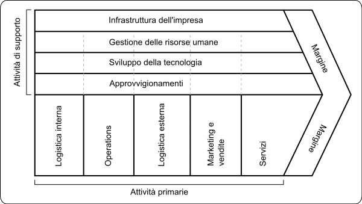

# Organizzazione di impresa e ICT

Il capitolo <u>"Organizzazione dell'impresa e ICT"</u> tratta di come le tecnologie dell'informazione e della comunicazione (ICT) si integrano con la struttura organizzativa di un'azienda. Un concetto fondamentale in questo contesto è il **controllo di gestione**, che è un meccanismo operativo che guida l'azienda verso il raggiungimento degli obiettivi stabiliti in fase di pianificazione.

## Controllo di gestione

### Cos'è il Controllo di Gestione?
Il controllo di gestione è un **processo** che consente alle aziende di <u>pianificare, monitorare e migliorare le proprie attività</u>. Attraverso la misurazione di indicatori specifici, il controllo di gestione confronta gli obiettivi pianificati con i risultati effettivi, informando gli organi responsabili degli scostamenti. Questo permette di intraprendere azioni correttive per migliorare il rendimento aziendale. Il controllo di gestione viene attuato annualmente e riguarda la previsione, l'organizzazione e la pianificazione delle attività.

### A Cosa Serve il Controllo di Gestione?
Il controllo di gestione serve a:
*   Fornire un <u>**feedback** sull'operato dell'azienda</u>, consentendo di migliorare le prestazioni.
*   Analizzare le risorse economiche e i fattori produttivi per assicurare un impiego adeguato.
*   Supportare il management aziendale nel prendere decisioni vincenti.
*   Pianificare e monitorare il raggiungimento degli obiettivi aziendali.

#### **Attività Principali del Controllo di Gestione:**

Le principali attività del controllo di gestione includono:
*   **Contabilità generale e bilancio d'esercizio**: Tenuta dei conti aziendali, registrazione di entrate, uscite, costi e ricavi. Il bilancio d'esercizio è una sintesi della contabilità generale.
*   **Riclassificazione e analisi di bilancio**: Revisione della struttura economica e finanziaria del bilancio per controllare l'adeguatezza degli investimenti tramite indicatori di performance.
*   **Contabilità analitica e analisi dei costi**: Monitoraggio dei costi, ricavi e risultati economici per ogni singolo oggetto (prodotto, personale, ecc.).
*  **Controllo del budget e analisi degli scostamenti**: Previsione del bilancio, stima di costi e ricavi, e analisi delle variazioni rispetto alle previsioni per ripianificare le attività.
*   **Reporting**: Verifica dei piani aziendali e degli obiettivi raggiunti.
*  **Piano delle vendite**: Previsione delle quantità di prodotti da vendere, con i relativi prezzi, mese per mese.
*   **Piano degli approvvigionamenti**: Calcolo degli acquisti necessari, del personale, degli impianti e dei costi di produzione per ogni prodotto.
*   **Analisi degli scostamenti**: Interpretazione delle variazioni rispetto alle previsioni per modificare la pianificazione successiva.

#### **Esempio di Processo di Controllo di Gestione:**
Un esempio di processo di controllo di gestione è:
1.  Il direttore generale richiede al direttore vendite un piano delle vendite.
2.  Dopo l'approvazione del piano delle vendite, il direttore generale lo consegna al direttore della produzione per creare il piano degli approvvigionamenti.
3.  I piani di vendita e approvvigionamenti vengono consegnati al direttore del personale per valutare eventuali nuove assunzioni.
4.  Il magazzino si assicura di avere le materie prime necessarie entro le date previste.
5.  Si sommano i costi per ottenere un'ipotesi di conto economico.
6.  Il piano viene approvato dal Consiglio di Amministrazione (CdA).
7. Le previsioni diventano obiettivi per i reparti e si effettua l’analisi degli scostamenti.

#### **Funzioni e Processi:**
In un'azienda, è importante distinguere tra funzioni e processi:
*   **Processo**: Insieme di attività e decisioni finalizzate alla creazione di un output richiesto dal cliente. Ogni processo utilizza **input** (risorse in entrata) e produce **output**.
*   **Funzione**: Aggregazione di persone e mezzi per svolgere attività della stessa natura. Le funzioni raggruppano attività con competenze simili e risorse comuni.
    *   Esempi di funzioni: amministrativa, contabilità, produzione.

## **Analisi di Porter:**
L'analisi di Porter descrive la struttura di un'organizzazione come una catena del valore, distinguendo tra:
*   **Processi primari**: Attività che contribuiscono direttamente alla creazione del valore, trasformando le materie prime in prodotti finiti.
*   **Processi di supporto**: Attività necessarie al funzionamento dell'organizzazione ma che non contribuiscono direttamente alla creazione dell'output.

## **Paradosso di Strassmann:**
Il paradosso di Strassmann evidenzia che negli anni '80 non c'era correlazione tra gli investimenti in ICT e la produttività. Questo ha portato a un cambiamento di approccio, passando da una visione **statica**, in cui la tecnologia supportava processi esistenti, a una visione **dinamica**, in cui la tecnologia viene utilizzata per trasformare i processi e l'organizzazione.

In sintesi, il controllo di gestione è un elemento chiave per guidare l'azienda verso il successo, monitorando le performance, analizzando i risultati, e allineando le attività con gli obiettivi strategici. La comprensione delle funzioni, dei processi e delle analisi come quella di Porter è essenziale per migliorare l'organizzazione e l'efficacia dei sistemi informativi aziendali.
