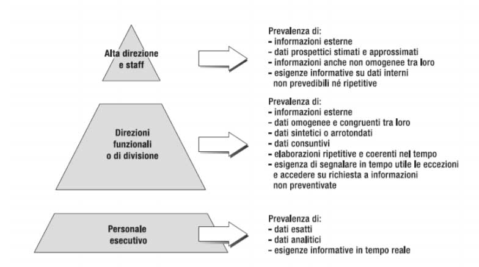

# La piramide di Anthony

La **piramide di Anthony** è un modello gerarchico che classifica l'organizzazione di imprese e industrie in base al comportamento organizzativo aziendale. Questo modello è stato sviluppato da Robert Anthony ed ha avuto una forte influenza sul pensiero manageriale.

### **Scopo della Piramide di Anthony**:

*   La piramide di Anthony serve come sistema di classificazione per organizzare le attività aziendali.
*   Il modello si basa sull'idea che i diversi livelli di un'organizzazione hanno obiettivi con diversi orizzonti temporali e quindi diversa importanza per il destino dell'azienda.

### **I tre livelli della piramide di Anthony**:

*   **Livello Strategico**
    *   È il livello più alto della piramide.
    *   Si occupa delle decisioni che riguardano le sorti dell'azienda nel lungo periodo.
    *   Le attività strategiche includono la pianificazione e la definizione degli obiettivi di medio-lungo periodo.
    *   Richiede informazioni principalmente esterne all'azienda, dati prospettici, stimati e non omogenei.
    *   Le informazioni necessarie sono spesso non strutturate e imprevedibili e il supporto informativo deve essere molto flessibile.
    *   Le decisioni prese a questo livello sono difficilmente strutturabili.
*   **Livello Tattico**
    *   È il livello intermedio della piramide.
    *   Si occupa della programmazione e del controllo delle risorse per raggiungere gli obiettivi prefissati dal livello strategico nel medio periodo.
    *   Le attività tattiche sono più ripetitive e sistematiche rispetto a quelle strategiche.
    *   Richiede informazioni interne all'azienda, dati omogenei e sintetici, elaborati in maniera ripetitiva.
    *   Il sistema informativo per il livello tattico deve segnalare eccezioni o anomalie e produrre informazioni "su richiesta".
    *   Le decisioni prese a questo livello sono mediamente strutturabili.
*   **Livello Operativo**
    *   È il livello più basso della piramide.
    *    Si occupa delle attività esecutive che consentono all'azienda di funzionare nel breve periodo.
    *   Le attività operative sono ripetitive e con un margine di discrezionalità decisionale molto ridotto.
    *   Richiede dati esatti, analitici e forniti in tempo reale.
    *   Il supporto informativo deve essere stabile nel tempo, senza necessità di flessibilità.
    *   Le decisioni prese a questo livello sono completamente strutturabili.

### **Caratteristiche dei livelli:**
*   **Orizzonte temporale**: Strategico (lungo termine), Tattico (medio termine), Operativo (breve termine).
*   **Orientamento**: Il livello strategico è orientato all'esterno, mentre gli altri livelli sono orientati all'interno.
*   **Discrezionalità**: La discrezionalità è massima a livello strategico e minima a livello operativo.
*   **Ripetitività**: Le attività operative sono molto ripetitive, mentre quelle strategiche lo sono meno.
*   **Prevedibilità**: Le attività operative sono le più prevedibili, mentre quelle strategiche sono le meno prevedibili.

#### **Rapporto tra i livelli**:

*   I livelli della piramide di Anthony sono aperti e interscambiabili.
*   Le persone possono salire di livello nell'azienda in base al loro ruolo.
*   Le tecnologie, come l'informatica, possono evolvere dal livello operativo a quello strategico.

In sintesi, la piramide di Anthony fornisce un modello per comprendere come le attività aziendali sono organizzate a diversi livelli, ciascuno con i propri obiettivi, orizzonti temporali e necessità informative.
